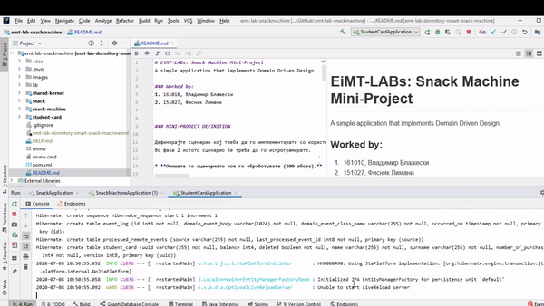

# EiMT-LABs: Snack Machine Mini-Project
A simple application that implements Domain Driven Design

### Worked by:
1. 161010, Владимир Блажески
2. 151027, Фисник Лимани


### MINI-PROJECT DEFINITION

Дефинирајте сценарио кој треба да го имплементирате со користење на алатките од Domain Driven Design и кое треба да биде по сложеност слично на сценариото на аудиториски вежби. Како потсетување, користете го презентациите за Strategic Design и Tactical Design кои се поставени на курсот.
Во фаза 2 истото сценарио ќе треба да го испрограмирате.

* **Опишете го сценариото кое го обработувате (200 збора).**

    Сценариото кое оваа проектна задача ќе го обработува и за кое сметаме дека 
соодветно ќе ги исполни барањата на самиот мини проект е “Работата на паметна машина за Ужинки (Snacks)”. 
Самото сценариото опфаќа машина за ужинки (Snack Machine) 
која конкретно се наоѓа во студентски дом, 
проширувајќи ја дополнително функционалноста на студентската 
картичка која ја има секој студент кој престојува во студентски 
дом. Секоја студентска картичка покрај останатото сега ќе има 
одреден број кредити(поени) кои студентскиот дом ги префрла 
секој месец на картичките на сите студенти. 
Секој студент со својата картичка ќе може да купи одредена ужинка 
(Snack) од самата машина. Притоа бројот на кредити(поени) е 
ограничен и студентот ќе може да купи само ако има доволно поени 
на својата картичка. 
Дополнително самата машина нуди неколку услови(функционалности) 
како : Доколку студентот нема доволно поени на картичката тој 
може да влезе во дозволен минус кој ќе биде одземен од картичката 
при повторно префрлување на кредити на почеток на месец и 
дополнително доколку студентот купил 5 пати од машината следниот 
производ ќе го добие бесплатно.


* **Идентификувајте ги ентитетите и релациите меѓу нив кои ви се потребни за имплементација на сценариото. Бројот на дефинирани ентитети мора да биде најмалку**

* **Идентификувајте ги ентитетите и релациите меѓу нив кои ви се потребни за имплементација на сценариото. Бројот на дефинирани ентитети мора да биде најмалку 3.**

* **Идентификувајте ги ограничените контексти (bounded contexts) во вашето сценарио**

* **Идентификувајте ги агрегатите во секој од ограничените контексти**

* **Идентификувајте го Aggregate Root на секој од идентификуваните агрегати**

* **Идентификувајте неколку настани (events) кои треба да протекуваат помеѓу агрегатите**

Сите од горенаведените прашања ќе бидат одговорени со следниот дијаграм:


* **Идентификувајте неколку правила за конзистентност (бизнис правила) во сценариото. Специфицирајте кој ентитет ќе ги поседува имплементациите на истите?**

    - Купувањето ќе може да се оствари само доколку студентот има доволно салдо на студентската картичка (SnackMachine го праша StudentCard за балансот на студентот)
    - Продуктот не може да биде купен доколку го немам на слотот (SnackMachine го праша Snack за количината)
    - Може да купи доколку нема доволно средства, но да не надмине повеќе од 100 денари од месечното салдо на сметката (секој месец студентскиот дом уплаќа точно дефинирана сума на пари)(SnackMachine, StudentCard)
    - Доколку студентот купил 10 продукти, наредниот го добива бесплатно (SnackMachine, StudentCard)

* **Идентификувајте неколку вредносни објекти (value-objects) во вашето сценарио. Кои методи би ги имплементирале?**

    - Money
        - ```Money subtract(Money money)``` 
        - ```Money add(Money money)```
        - ```Money multiply(int multiplicand)```
        - ```boolean isGreaterOrEqualThan(Money money)```
        - ```boolean isGreaterOrEqualThanMinus100MKD(Money money)```
    - PurchaseNumber
        - ```PurchaseNumber addOne()```
    - FullName
    - Quantity
        - ```Quantity subtractQuantityPerOne()```
        - ```Quantity addQuantity(int quantity)```
        
        

- **ENDPOINTS**:
    - **SnackMachine**
        - GET: http://localhost:8081/api/snackmachine/id
            - id - StudentCardId
        - POST: http://localhost:8081/api/snackmachine/purchase
            - JSON Body - {studentCardId: "...", slotPosition: "..."}
        - GET: http://localhost:8081/api/snackmachine/slots
        - GET: http://localhost:8081/api/snackmachine/slots/id
            - id - SlotId
        - GET: http://localhost:8081/api/snachmachine
      
    - **Snack**
        - GET: http://localhost:8082/api/snacks
        - GET: http://localhost:8082/api/snacks/id
            - id - SnackId
    
    - **StudentCard**
        - GET: http://localhost:8083/api/studentcards/id
            - id - StudentCardId
        - GET: http://localhost:8083/api/studentcards

# Demo

